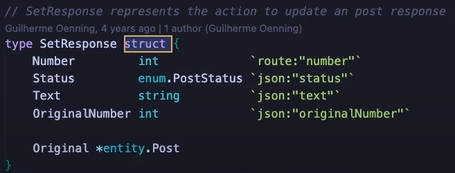
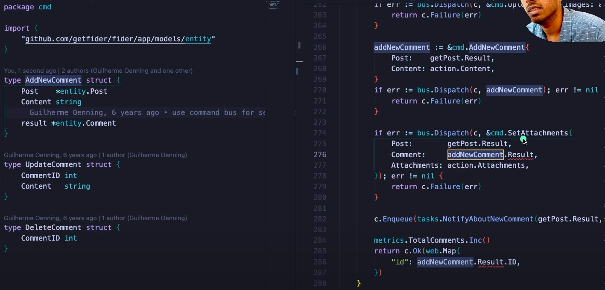

# Part 3

- Before getting started i will create a go.mod file for Part3 learning using the following command.

```bash
abhis@Tinku MINGW64 ~/Desktop/GoBasics/Part3 (main)
$ go mod init github.com/abhimvp/GoBasics/Part3
go: creating new go.mod: module github.com/abhimvp/GoBasics/Part3
```

---

## Reference Types

Go has around five types of reference types - pointers, slices, functions, channels, maps.

- Reference Types means they don't have data themselves they refer to some other data type that works in the background to have the data,

- **Pointers**

Go has pointers. A pointer `holds the memory address of a value`.

The type \*T is a pointer to a T value. Its zero value is nil.

var p \*int
The & operator generates a pointer to its operand.

i := 42
p = &i
The \* operator denotes the pointer's underlying value.

fmt.Println(*p) // read i through the pointer p
*p = 21 // set i through the pointer p
This is known as "dereferencing" or "indirecting".

Unlike C, Go has no pointer arithmetic.

## structs

A struct is a collection of fields(different data types).

- one of the Aggregator types, another one is arrays(collection of similar data types)

- struct is a GO's Native type.
- Struct fields are accessed using a dot.
- Pointers to structs: Struct fields can be accessed through a struct pointer. (`Very Important and something we use a lot`)
  - To access the field X of a struct when we have the struct pointer p we could write (\*p).X. However, that notation is cumbersome, so the language permits us instead to write just p.X, without the explicit dereference.
- Struct Literals:

  - A struct literal denotes a newly allocated struct value by listing the values of its fields.
  - You can list just a subset of fields by using the Name: syntax. (And the order of named fields is irrelevant.)
  - The special prefix & returns a pointer to the struct value.

- struct are something you'll use a lot when working on backend systems.
- If you get some JSON from frontend - you have to parse it and store it into a struct before you can use it in your go program. - `GOOD Example to remember & relate`
- `unmarshaling` concept & refer fider project on how struct is used and it's tags as well.

- `type Struct_Name struct { Field_Name Field_type tags}` - we can store any type of data inside them.
  
  - Also capitalize the first Character of fields in Naming structs as we can see above all the fields starts in capital letters. comes under go's encapsulation concept, where we can use those fields starting with Capital letter outside of its package & also of-course doesn't allows the words starting with small letters which are private variables. Look at below example of errors when we try to access private value in a struct.
    

## arrays

The type `[n]T` is an array of n values of type T.

The expression: - `var a [10]int` -> declares a variable a as an array of ten integers.

An **array's length is part of its type**, so `arrays cannot be resized`. This seems limiting, but don't worry; Go provides a convenient way of working with arrays. We don't use arrays often in real world application we use another data structure called slices.

## Slices

An array has a fixed size. `A slice, on the other hand, is a dynamically-sized`, flexible view into the elements of an array. In practice, slices are much more common than arrays.

The type []T is a slice with elements of type T.

A slice is formed by specifying two indices, a low and high bound, separated by a colon:

a[low : high]
This selects a half-open range which includes the first element, but excludes the last one.

The following expression creates a slice which includes elements 1 through 3 of a: a[1:4]

- Slices are like references to arrays:

  - A `slice does not store any data`, it just describes a section of an underlying array.
  - Changing the elements of a slice modifies the corresponding elements of its underlying array.
  - Other slices that share the same underlying array will see those changes.

- Slice literals : A slice literal is like an array literal without the length.

- Slice defaults
  When slicing, you may omit the high or low bounds to use their defaults instead.

The default is zero for the low bound and the length of the slice for the high bound.

For the array

var a [10]int
these slice expressions are equivalent:

a[0:10]
a[:10]
a[0:]
a[:]

- Slice length and capacity
  A slice has both a length and a capacity.

The length of a slice is the number of elements it contains.

The capacity of a slice is the number of elements in the underlying array, counting from the first element in the slice.

The length and capacity of a slice s can be obtained using the expressions len(s) and cap(s).

You can extend a slice's length by re-slicing it, provided it has sufficient capacity. Try changing one of the slice operations in the example program to extend it beyond its capacity and see what happens.

- Nil slices
  The zero value of a slice is nil.

A nil slice has a length and capacity of 0 and has no underlying array.

- Creating a slice with make
  Slices can be created with the built-in make function; this is how you create dynamically-sized arrays.

The make function allocates a zeroed array and returns a slice that refers to that array:

```go
a := make([]int, 5)  // len(a)=5
// To specify a capacity, pass a third argument to make:

b := make([]int, 0, 5) // len(b)=0, cap(b)=5

b = b[:cap(b)] // len(b)=5, cap(b)=5
b = b[1:]      // len(b)=4, cap(b)=4
```

- Slices of slices : Slices can contain any type, including other slices.

- Appending to a slice : It is common to append new elements to a slice, and so Go provides a built-in append function. The documentation of the built-in package describes `append`.

func append(s []T, vs ...T) []T
The first parameter s of append is a slice of type T, and the rest are T values to append to the slice.

The resulting value of append is a slice containing all the elements of the original slice plus the provided values.

If the backing array of s is too small to fit all the given values a bigger array will be allocated. The returned slice will point to the newly allocated array.

- `When we are trying to append single elements, append will try to double the capacity, every time there is no space, upto the threshold length=256, after that it will grow in 1.25x instead of 2x. we can see the comment in go official docs`

## range

- Go provides one more construct to loop over slices.- that's Range

The range form of the for loop iterates over a slice or map.

When ranging over a slice, two values are returned for each iteration. The first is the index, and the second is a copy of the element at that index.

Range continued
You can skip the index or value by assigning to \_.

```go
for i, _ := range pow
for _, value := range pow
If you only want the index, you can omit the second variable.

for i := range pow
```

## Maps

A map maps keys to values.

The `zero value` of a `map` is `nil`. A `nil` map has no keys, `nor can keys be added`.

The `make` function returns a map of the given type, initialized and ready for use.

- we use `map` whenever we have a use-case where we want to find things quickly - that'sthe mental model you should have.

- Don't get confused between map and struct

  - struct is typical use case whenever we want to store something - whenever you want to pass data from a JSON
  - In map also you can store values but we use it when we want to find things quickly

- Map literals : Map literals are like struct literals, but the keys are required.

- Mutating Maps :
  Insert or update an element in map m:
  m[key] = elem

Retrieve an element:
elem = m[key]

Delete an element:
delete(m, key)

Test that a key is present with a two-value assignment:
elem, ok = m[key]

If key is in m, ok is true. If not, ok is false.

If key is not in the map, then elem is the zero value for the map's element type.

Note: If elem or ok have not yet been declared you could use a short declaration form:
elem, ok := m[key]

- NEVER USE var to declare a map


